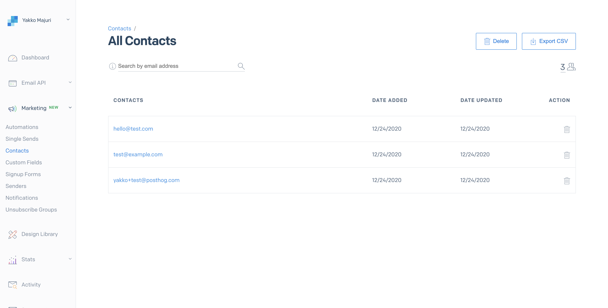

# Sendgrid Plugin

Send emails and user data to Sendgrid when you identify users using PostHog.

## Installation

1. Visit 'Project Plugins' under 'Settings'
1. Enable plugins if you haven't already done so
1. Click '+ Install new plugin' and use this URL to install: `https://github.com/PostHog/sendgrid-plugin`
1. Add your [Sendgrid](sendgrid.com) API key at the configuration step
1. Enable the plugin and watch your contacts list get populated in Sendgrid!
